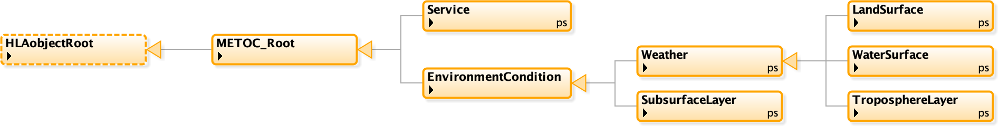
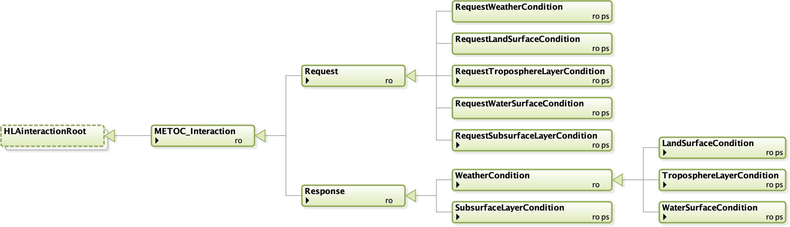

# NETN-METOC

|Version| Date| Dependencies|
|---|---|---|
|1.1|2023-03-18|NETN-BASE|

The purpose of the NATO Education and Training Network (NETN) Meteorological and Oceanographic (METOC) Module is to provide a standard way to exchange data related to weather conditions and primary effects of weather on terrain, on water surfaces, in the atmosphere and subsurface water conditions. The main objective is to provide a reference model that represents a core common subset of METOC-related aspects and to allow the extension of the module to incorporate additional detail if required. Therefore, the NETN-METOC module shall be viewed as a reference FOM module where extensions are not only allowed but encouraged to fully meet federation-specific requirements. However, any extension should also be considered as a candidate for improving the NETN-METOC module or candidates for new standard NETN modules.         

This module is a specification of how to represent METOC-related data to be shared among participants in a federated distributed simulation. The specification is based on IEEE 1516 High Level Architecture (HLA) Object Model Template (OMT) and is primarily intended to support interoperability in a federated simulation (federation) based on HLA. An HLA-based Federation Object Model (FOM) is used to specify types of data and how it is encoded on the network. The NETN-METOC FOM module is available as an XML file for use in HLA-based federations.

Current weather conditions impact simulations such as platforms and sensors on the ground, on the sea, underwater and in the air. In a federated distributed simulation a correlated representation of these conditions is key to meeting interoperability and model requirements. Different simulations require different fidelity of weather conditions concerning data resolution and accuracy.  The NETN-METOC focus on the representation of weather conditions for related surfaces and layers. The main difference is that a surface condition does not have a volume and only represents the conditions directly related to the surface of a piece of terrain or water. The layer conditions represent a volume of water or air and are specified with height/depth from surface and layer thickness. Both concepts are also geographically positioned by reference to other concepts shared in the federation such as the position of objects, areal objects or reference to terrain features such as roads etc.  Based on these concepts different levels of fidelity in representing weather conditions can be achieved. Global conditions can be expressed as well as highly detailed conditions e.g. surrounding a specific aircraft.  
        

The aspects and attributes of weather conditions included in the scope of the NETN-METOC module are based on input from several sources and are designed to cover the most common levels of representation required by a large set of existing simulators.
## Overview 
 
Environment Conditions are either surface-based (land or water) or a layer (above terrain or below the water surface) and include either weather attributes or sub-surface (Water) attributes. 
 
* Tropospheric Layer Conditions cover the following aspects: Temperature, Winds, Precipitation, Haze, Humidity, Barometric Pressure, Visibility Range and Clouds. 
 
* Water Layer Conditions cover the following aspects: Temperature, Salinity, and Currents. 
 
* Land Surface Conditions cover the following aspects: Temperature, Winds, Precipitation, Haze, Humidity, Barometric Pressure, Visibility Range, Snow Condition, Moisture and Ice Condition 
 
* Water Surface Conditions cover the following aspects: Temperature, Winds, Precipitation, Haze, Humidity, Barometric Pressure, Visibility Range, Sea State, Salinity, Tide, Ice Conditions, Currents, Waves and Swell. 
 
* Subsurface Layer Conditions cover the following aspects: Temperature, Current, Salinity and BottomType. 
 
To exchange Environment Conditions, the NETN-METOC offers two methods of interaction. 
 
1. Pull: Request and Response pattern for Environment Conditions based on HLA Interaction Classes. 
2. Push: Request for Continuous updates of Environment Condition based on HLA Interactions and then updates of HLA Object instance attributes. 
 
Depending on federation design and agreements, one or both methods may be suitable.
## Environment Condition

Environment Conditions can be modelled by any federate to represent METOC data. Multiple overlapping `EnvironmentCondition` objects may exist and subscribing federates should apply merge rules to calculate the resulting environment conditions. A METOC server may subscribe to multiple `EnvironmentCondition` objects and deliver correlated METOC data using a Request and Response pattern implemented as HLA interactions. 

Environment conditions are always related to either the entire synthetic environment (global), a static or dynamic location, a region or a layer.This means that an environmental condition can be related to:
* Specific geographical location
* Specific geographical region
* A specific simulated entity position
* A volume of air
* A body of water
* A feature identified in a terrain database using Geography Markup Language (GML) identifiers

### Overlapping Environment Conditions
If EnvironmentConditions with overlapping regions/locations exist, the following rules apply: 

* Wind Speed, Wind Direction, Precipitation Intensity, Temperature, Humidity, BarometricPressure, Snow Depth, Snow Density are calculated as the average in the overlapping EnvironmentConditions
* Visibility is calculated as the minimum visibility distance of the overlapping EnvironmentConditions.
* Conflicting precipitation types are resolved according to the following precedence: Snow, Hail, Rain, No Precipitation. E.g. If there is one overlapping Environment Condition with Snow, the result is always Snow.
* For the same Haze type the average density should be used. Multiple overlapping EnvironmentConditions with different Haze type can exist.
* Moisture is calculated as the highest enumerated value making the resulting value the one with most moisture.
* LandSurface ice condition is calculated as the highest enumerated value making the resulting value the one with most severe ice condition.
## Service

A simulation capable of modelling environment conditions in the federated distributed environment registers a `Service` object instance and publish information that specifies the source and type of the METOC data available. All METOC data in the federation refers to the producing `Service` and requests for METOC data can be directed to a specific service.  

Multiple METOC service providers may exist in a federation, and the use of these services should be specified in federation specific agreements.

## Object Classes

Note that inherited and dependency parameters are not explicitly listed for each interaction class below. Only parameters defined in this FOM Module are listed. 

**Figure: Object Classes**

### METOC_Root

    
|Attribute|Datatype|Semantics|
|---|---|---|
|Name|HLAunicodeString|Optional. Name of the Environment Condition or METOC Service.|
### Service

All systems providing EnvironmentCondition information as either object instances or as responses to service requests must register a Service object instance.
    
|Attribute|Datatype|Semantics|
|---|---|---|
|ModelType|WeatherModelTypeEnum32|Required. Type of METOC model provided by the Service. Specifies whether the Service delivers Simulated, Real (Historical), Live (Current) or Standard model data.|
### EnvironmentCondition

Root class for all types of EnvironmentCondition objects. 
 
The region where the EnvironmentCondition applies is defined by the GeoReference attribute, as follows. 
 
If GeoReference is provided as a geographical area, and the subclass in question has surface semantics (water/land), the EnvironmentCondition applies only within that area of the surface. 
 
If GeoReference is provided as a geographical area, and the sub-class in question defines a Layer attribute, the EnvironmentCondition applies only within the volume bounded both by the Layer and by the body described by projecting each point of the area along a line through the centre of the earth. (This means, e.g., that any volumes described by two adjacent geodetic quadrangles will never overlap, and if they belong to the same layer, will also be adjacent.) 
 
If GeoReference is provided as an RPREntityReference, NETNEntityReference or GMLFeatureReference identifying a feature (as opposed to a geometry object), the EnvironmentCondition is considered to apply only to the immediate vicinity of the referenced entity/feature: any Layer attribute specified by a subclass is ignored in this case. 
 
If not provided, the EnvironmentCondition is considered global, only restricted by the semantics of its particular subclass.
    
|Attribute|Datatype|Semantics|
|---|---|---|
|GeoReference|GeoReferenceVariant|Optional. A geographical location, region, feature or simulated object.|
|ServiceId|UUID|Required. Identifies the METOC Service which produced the EnvironmentCondition object.|
### Weather

The `Weather` object class represents typical weather-related attributes such as temperature, wind and precipitation is represented but also details regarding barometric pressure and humidity. Information about Visual Range and Haze conditions can also be represented. Additional environment condition details for `LandSurface`, `WaterSurface` and in `TroposphereLayer` are provided in corresponding subclasses. 
 
All attributes of WeatherCondition objects are optional. 
An instance of this class without a GeoReference is considered global above sea level.
    
|Attribute|Datatype|Semantics|
|---|---|---|
|BarometricPressure|AtmosphericPressureFloat32|Optional. Barometric pressure measured in millibar or hectopascal (1 mbar = 1hPa) in the region/location specified by the Environment Condition.  If EnvironmentConditions with overlapping regions/locations exist the average barometric pressure should be used.|
|Haze|HazeStruct|Optional. Current Haze type and density in the region/location specified by the Environment Condition. Default is No Haze.  If EnvironmentConditions with overlapping regions/locations exist having the same Haze type the average density should be used.|
|Humidity|PercentFloat32|Optional. Humidity in percent in the region/location specified by the Environment Condition. Default is 75% (Normal value)  If EnvironmentConditions with overlapping regions/locations exist the average humidity should be used.|
|Precipitation|PrecipitationStruct|Optional. Current precipitation type and intensity in the region/location specified by the Environment Condition. Default is No Precipitation.  If EnvironmentConditions with overlapping regions/locations exist the average intensity should be used.  Conflicting precipitation types are resolved according to the following precedence: Snow, Hail, Rain, No Precipitation.  E.g. If there is one overlapping Environment Condition with Snow the result is always Snow.|
|Temperature|TemperatureDegreeCelsiusFloat32|Optional. Temperature in the region/location specified by the EnvironmentCondition.  If EnvironmentConditions with overlapping regions/locations exist the average temperature should be used.|
|VisibilityRange|MeterFloat32|Optional. The distance at which an object or light can be clearly discerned by the human eye in the region/location specified by the Environment Condition.  If EnvironmentConditions with overlapping regions/locations exist the minimum distance should be used.|
|Wind|WindStruct|Optional. Wind speed and direction in the region/location specified by the EnvironmentCondition.  If EnvironmentConditions with overlapping regions/locations exist the average wind speed and direction should be used.|
### LandSurface

The environmental conditions related to a land surface. 
Besides the common attributes such as temperature, wind and precipitation etc. additional detail regarding snow, moisture, and ice conditions of the land surface can be represented. 
All attributes of LandSurfaceCondition objects are optional. 
An instance of this class without a GeoReference is considered to apply to all land surfaces.
    
|Attribute|Datatype|Semantics|
|---|---|---|
|IceCondition|RoadIceConditionEnum16|Optional. Surface ice condition in the region/location specified by the EnvironmentCondition. Default is no ice.  If EnvironmentConditions with overlapping regions/locations exist, surface ice condition is calculated as the highest enumerated value making the resulting value the one with the most severe ice condition.|
|Moisture|SurfaceMoistureEnum16|Optional. Surface moisture in the region/location specified by the EnvironmentCondition. Default is 0 (Dry).  If EnvironmentConditions with overlapping regions/locations exist, moisture is calculated as the highest enumerated value making the resulting value the one with most moisture.|
|Snow|SnowStruct|Optional. Current snow depth and density in the region/location specified by the EnvironmentCondition. Default is no snow.  If EnvironmentConditions with overlapping regions/locations exist the average snow depth and density should be used.|
### WaterSurface

The Condition of the sea surface in the specified region. An instance of this class without a GeoReference is considered to apply to all water surfaces.
    
|Attribute|Datatype|Semantics|
|---|---|---|
|Current|CurrentStruct|Optional. Current on water surface. Default is no current. Ignored if surface has 100% Ice coverage. If EnvironmentConditions with overlapping regions/locations exist, the current in the overlapping region is the average current direction and speed.|
|Ice|IceStruct|Optional. Ice condition on surface. Default is no ice. If EnvironmentConditions with overlapping regions/locations exist, the ice condition in the overlapping region is determined by the latest updated value.|
|Salinity|PercentFloat32|Optional. Salinity of sea water on the practical salinity scale 1978 (PSS-78). Default value is 35 (equivalent to 35 parts per thousand). If EnvironmentConditions with overlapping regions/locations exist the average salinity should be used.|
|SeaState|SeaStateEnum16|Optional. State of sea surface. Default is Calm_glassy. If EnvironmentConditions with overlapping regions/locations exist, the sea state in the overlapping region is determined by the latest updated value.|
|Swell|WaveStruct|Optional. Swell of the body of water. Default is no Swell. Ignored if surface has 100% Ice coverage. If EnvironmentConditions with overlapping regions/locations exist, the swell condition in the overlapping region is determined by the latest updated value.|
|Tide|MeterFloat32|Optional. The height of the current tide relative to MSL. Default is 0. If EnvironmentConditions with overlapping regions/locations exist, the value for the overlapping region is the average Tide value.|
|Wave|WaveStruct|Optional. Waves on the water surface. Default is no waves. Ignored if surface has 100% Ice coverage. If EnvironmentConditions with overlapping regions/locations exist, the wave condition in the overlapping region is determined by the latest updated value.|
### TroposphereLayer

The `TroposphereLayer` object class is used to associate weather and environmental conditions to a specific layer in the troposphere. Additional information on cloud coverage can be defined. 
 
If overlapping Atmospheric Conditions exist the following merging rules apply: 
Humidity, AirTemperature and BarometricPressure are calculated as the average of the overlapping conditions. 
Visibility is calculated as the minimum visibility distance of the overlapping conditions. 
A TroposhpereLayer instance without a GeoReference is considered global within its specified Layer.
    
|Attribute|Datatype|Semantics|
|---|---|---|
|Cloud|CloudStruct|Optional. Data about Clouds in the Atmospheric layer. Default is no clouds. If EnvironmentConditions with overlapping regions/locations exist, the cloud condition in the overlapping region is determined by the latest updated value.|
|Layer|LayerStruct|Optional. Volume of atmosphere extending from a base altitude upwards (see LayerStruct). Any portion of the Layer extending below sea level is ignored. If Layer is not provided, it is considered to extend from the surface of the earth upward indefinitely.|
### SubsurfaceLayer

EnvironmentCondition of a subsurface water layer. If GeoReference is not provided, the condition is considered global within the specified Layer.
    
|Attribute|Datatype|Semantics|
|---|---|---|
|BottomType|SedimentTypeEnum32|Optional. Type of sediment on the sea floor. Default is NoSediment. If EnvironmentConditions with overlapping regions/locations exist, the sediment type in the overlapping region is determined by the latest updated value.|
|Current|CurrentStruct|Optional. Describes current in the water layer. Default is no current. If EnvironmentConditions with overlapping regions/locations exist the average current direction and speed should be used.|
|Layer|LayerStruct|Optional. A body of water extending from a (negative) base altitude upwards (see LayerStruct). Any portion of the Layer extending above sea level is ignored. If Layer is not provided, it is considered to extend from the sea floor to the surface of the water.|
|Salinity|SalinityFloat32|Optional. Salinity of sea water on the practical salinity scale 1978 (PSS-78). Default value is 35 (equivalent to 35 parts per thousand). If EnvironmentConditions with overlapping regions/locations exist the average salinity should be used.|
|Temperature|TemperatureDegreeCelsiusFloat32|Optional. Temperature in the region/location specified by the EnvironmentCondition.  If EnvironmentConditions with overlapping regions/locations exist the average temperature should be used.|

## Interaction Classes

Note that inherited and dependency parameters are not explicitly listed for each interaction class below. Only parameters defined in this FOM Module are listed. 

**Figure: Interaction Classes**

### METOC_Interaction

Root class for requesting environment data from a METOC Service.
    
|Parameter|Datatype|Semantics|
|---|---|---|
|EventId|UUID|Required: Unique identifier of the request. Will be referenced in a resulting resulting METOC_Response interaction.|
### Request

A request to a specified METOC Service to provide METOC data for a specific geographical reference. The request can result in either a response interaction including the requested data or registration of an EnvironmentCondition object for continuous updates.
    
|Parameter|Datatype|Semantics|
|---|---|---|
|GeoReference|GeoReferenceVariant|Optional. Geographical reference to indicate for which point, area, path or object this request is related to. If not provided, the request is for a global environment condition.|
|ServiceId|UUID|Required: Unique identifier of the model used for providing METOC information. Multiple Models may exist.|
|UpdateAsObject|HLAboolean|Optional. Indicates if the service is requested to represent the environment condition as an EnvironmentCondition object instance. Default is False.|
### RequestWeatherCondition

Request for general weather data.
### RequestLandSurfaceCondition

Request for land surface condition data.
### RequestTroposphereLayerCondition

Request for tropospheric environment condition data.
    
|Parameter|Datatype|Semantics|
|---|---|---|
|Layer|LayerStruct|Optional. A description of layer for request of layered conditions troposphere environment condition. Default is the entire volume of air in the identified area.|
### RequestWaterSurfaceCondition

Request for water surface condition data.
### RequestSubsurfaceLayerCondition

Request for sub-surface condition data.
    
|Parameter|Datatype|Semantics|
|---|---|---|
|Layer|LayerStruct|Optional. A description of layer for request of layered subsurface environment conditions. Default is the entire body of water in the identified area.|
### Response

Response to a RequestEnvironmentCondition. RequestId paramater should match the corresponding parameter in the request.
    
|Parameter|Datatype|Semantics|
|---|---|---|
|EnvironmentObjectId|UUID|Optional. Reference to an existing environment condition object if the corresponding request includes UpdateAsObject set to true.|
|GeoReference|GeoReferenceVariant|Optional. Geographical reference to indicate for which point, area, path or object this request is related to. Default if not provided the environment condition data is global.|
|Status|HLAboolean|Required: Specifies the result of the request action. TRUE indicates success.|
### WeatherCondition

Response with general weather condition data.
    
|Parameter|Datatype|Semantics|
|---|---|---|
|BarometricPressure|AtmosphericPressureFloat32|Optional. Average barometric pressure measured in millibar or hectopascal (1 mbar = 1hPa) in the region/location.|
|Haze|HazeStruct|Optional. Average haze density in the region/location,|
|Humidity|PercentFloat32|Optional. Average humidity in percent in the region/location.|
|Precipitation|PrecipitationStruct|Optional. Average precipitation intensisty region/location for a precipitation type in the following order of precedence Snow, Hail, Rain, NoPrecipitation.|
|Temperature|TemperatureDegreeCelsiusFloat32|Optional. Average temperature in the region/location.|
|VisibilityRange|MeterFloat32|Optional. Average distance at which an object or light can be clearly discerned by the human eye in the region/location.|
|Wind|WindStruct|Optional. Average wind speed and direction in the region/location.|
### LandSurfaceCondition

Response with condition for land surface.
    
|Parameter|Datatype|Semantics|
|---|---|---|
|IceCondition|RoadIceConditionEnum16|Optional. Most severe ice condition in the region/location.|
|Moisture|SurfaceMoistureEnum16|Optional. Maximum surface moisture in the region/location.|
|Snow|SnowStruct|Optional. Average snow depth and density in the region/location.|
### TroposphereLayerCondition

Response with environment condition in volume of air.
    
|Parameter|Datatype|Semantics|
|---|---|---|
|Cloud|CloudStruct|Optional. Cloud cover.|
### WaterSurfaceCondition

Response with water surface condition data.
    
|Parameter|Datatype|Semantics|
|---|---|---|
|Current|CurrentStruct|Optional. Surface water Current direction and speed. N/A if Ice|
|Ice|IceStruct|Optional. Ice conditions on the water surface.|
|Salinity|PercentFloat32|Optional. Salinity in the surface water.|
|SeaState|SeaStateEnum16|Optional. Sea state data.|
|Swell|WaveStruct|Optional. Surface water Swell data. N/A if Ice|
|Tide|MeterFloat32|Optional. The height relative to the MSL.|
|Wave|WaveStruct|Optional. Surface Wave data. N/A if Ice|
### SubsurfaceLayerCondition

Response with subsurface body of water condition data.
    
|Parameter|Datatype|Semantics|
|---|---|---|
|BottomType|SedimentTypeEnum32|Optional. Type of sediment on the sea floor. Default is 0 (NoSediment). If EnvironmentConditions with overlapping regions/locations exist, the sediment type in the overlapping region is determined by the latest updated value.|
|Current|CurrentStruct|Optional. Average current direction and speed in the body of water.|
|Salinity|SalinityFloat32|Optional. Average salinity in the body of water.|
|Temperature|TemperatureDegreeCelsiusFloat32|Optional. Average temperature in the body of water.|
## Datatypes

Note that only datatypes defined in this FOM Module are listed below. Please refer to FOM Modules on which this module depends for other referenced datatypes.

### Overview
|Name|Semantics|
|---|---|
|AtmosphericPressureFloat32|Pressure measured in Millibar or Hecto Pascal. 1 mbar = 1 hPa|
|CloudStruct|Description of cloud layer type, coverage and density.|
|CloudTypeEnum32|Classification of different types of clouds.|
|CurrentStruct|Water current direction and speed.|
|GMLidentifier|GML Feature ID.|
|GeoReferenceVariant|The area affected by an Environment Condition can be expressed as: - a location on the earth's surface represented by a Point, - an area on the earth's surface, represented by a Quadrangle, GeodeticPolygon, or GeodeticCircle, or - a reference to some other object/data. Objects that can be referenced are RPR entities, NETN entities, NETN-SE GeoObjects and GML Features.|
|HazeStruct|Type and density of haze material.|
|HazeTypeEnum32|Type of visibility obstruction.|
|IceStruct|Ice type, thickness and coverage on water surface.|
|IceTypeEnum16|Type of Ice.|
|LayerStruct|A layer of the Earth's environment expressed as a base altitude and a thickness.|
|PrecipitationIntensityFloat32|Light rain — when the precipitation rate is < 2.5 mm (0.098 in) per hour. Moderate rain — when the precipitation rate is between 2.5 mm (0.098 in) - 7.6 mm (0.30 in) or 10 mm (0.39 in) per hour. Heavy rain — when the precipitation rate is > 7.6 mm (0.30 in) per hour, or between 10 mm (0.39 in) and 50 mm (2.0 in) per hour. Violent rain — when the precipitation rate is > 50 mm (2.0 in) per hour.|
|PrecipitationStruct|Type and intensity of precipitation.|
|PrecipitationTypeEnum32|Type of precipitation.|
|RoadIceConditionEnum16|Ice condition for roads.|
|SalinityFloat32|Practical Salinity Unit (PSU) measured in g/kg.|
|SeaStateEnum16|State of the sea measured in Douglas Sea Scale.|
|SedimentTypeEnum32|The type of sediment on the sea floor.|
|SnowStruct|Depth and density of snow cover.|
|SurfaceMoistureEnum16|Road surface wetness or soil moisture.|
|WaveStruct|Water surface wave conditions and direction.|
|WeatherModelTypeEnum32|Type of weather model used by a METOC service.|
|WindStruct|Wind direction and speeds.|
        
### Simple Datatypes
|Name|Units|Semantics|
|---|---|---|
|AtmosphericPressureFloat32|hPa|Pressure measured in Millibar or Hecto Pascal. 1 mbar = 1 hPa|
|PrecipitationIntensityFloat32|mm/hour|Light rain — when the precipitation rate is < 2.5 mm (0.098 in) per hour. Moderate rain — when the precipitation rate is between 2.5 mm (0.098 in) - 7.6 mm (0.30 in) or 10 mm (0.39 in) per hour. Heavy rain — when the precipitation rate is > 7.6 mm (0.30 in) per hour, or between 10 mm (0.39 in) and 50 mm (2.0 in) per hour. Violent rain — when the precipitation rate is > 50 mm (2.0 in) per hour.|
|SalinityFloat32|PSU|Practical Salinity Unit (PSU) measured in g/kg.|
        
### Enumerated Datatypes
|Name|Representation|Semantics|
|---|---|---|
|CloudTypeEnum32|HLAinteger32BE|Classification of different types of clouds.|
|HazeTypeEnum32|HLAinteger32BE|Type of visibility obstruction.|
|IceTypeEnum16|HLAinteger16BE|Type of Ice.|
|PrecipitationTypeEnum32|HLAinteger32BE|Type of precipitation.|
|RoadIceConditionEnum16|HLAinteger16BE|Ice condition for roads.|
|SeaStateEnum16|HLAinteger16BE|State of the sea measured in Douglas Sea Scale.|
|SedimentTypeEnum32|HLAinteger32BE|The type of sediment on the sea floor.|
|SurfaceMoistureEnum16|HLAinteger16BE|Road surface wetness or soil moisture.|
|WeatherModelTypeEnum32|HLAinteger32BE|Type of weather model used by a METOC service.|
        
### Array Datatypes
|Name|Element Datatype|Semantics|
|---|---|---|
|GMLidentifier|HLAunicodeChar|GML Feature ID.|
        
### Fixed Record Datatypes
|Name|Fields|Semantics|
|---|---|---|
|CloudStruct|Type, Coverage, Density|Description of cloud layer type, coverage and density.|
|CurrentStruct|Direction, Speed|Water current direction and speed.|
|HazeStruct|Type, Density|Type and density of haze material.|
|IceStruct|Type, Thickness, Coverage|Ice type, thickness and coverage on water surface.|
|LayerStruct|Base, Thickness|A layer of the Earth's environment expressed as a base altitude and a thickness.|
|PrecipitationStruct|Type, Intensity|Type and intensity of precipitation.|
|SnowStruct|Depth, Density|Depth and density of snow cover.|
|WaveStruct|Length, Height, Period, Direction|Water surface wave conditions and direction.|
|WindStruct|Direction, HorizontalSpeed, VerticalSpeed|Wind direction and speeds.|
        
### Variant Record Datatypes
|Name|Discriminant (Datatype)|Alternatives|Semantics|
|---|---|---|---|
|GeoReferenceVariant|GeoReferenceType (GeoLocationTypeEnum32)|GeodeticLocation, GeodeticCircle, GeodeticQuadrangle, GeodeticPolygon, NETNGeoObjectReference, RPREntityReference, GMLFeatureReference|The area affected by an Environment Condition can be expressed as: - a location on the earth's surface represented by a Point, - an area on the earth's surface, represented by a Quadrangle, GeodeticPolygon, or GeodeticCircle, or - a reference to some other object/data. Objects that can be referenced are RPR entities, NETN entities, NETN-SE GeoObjects and GML Features.|
    