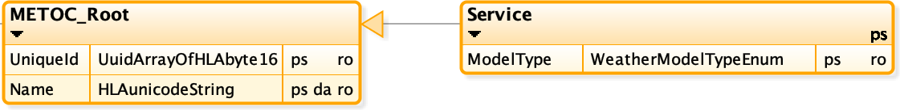
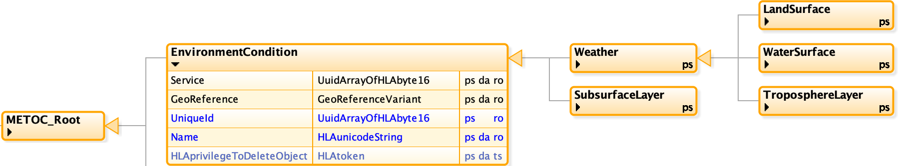
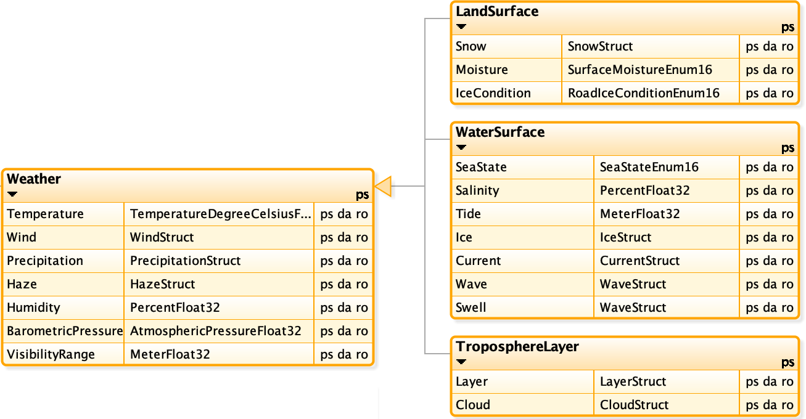
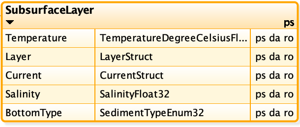
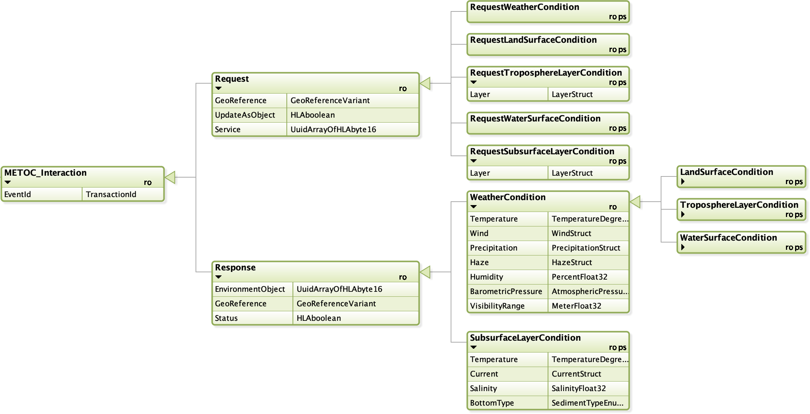

# NETN-METOC

Copyright (C) 2020 NATO/OTAN.
This work is licensed under a [Creative Commons Attribution-NoDerivatives 4.0 International License](LICENCE.md).

## Introduction
This module is a specification of how to represent METOC related data to be shared among participants in a federated distributed simulation. The specification is based on IEEE 1516 High Level Architecture (HLA) Object Model Template (OMT) and primarily intended to support interoperability in a federated simulation (federation) based on HLA. An HLA OMT based Federation Object Model (FOM) is used to specify types of data and how it is encoded on the network. The NETN METOC FOM module is available as a XML file for use in HLA based federations.

### Purpose
The purpose of the NETN METOC module is to provide a standard way to exchange data related to weather conditions and primary effects of weather on terrain, on water surfaces, in the atmosphere and subsurface water conditions. The main objective is to provide a reference model that represents a core common subset of METOC related aspects and to allow extension of the module to incorporate additional detail if required. Therefore, the NETN METOC module shall be viewed as a reference FOM module where extensions are not only allowed but encouraged to fully meet federation specific requirements. However, any extension should also be considered as candidates for improving the NETN METOC module or candidates for new standard NETN modules.         

### Scope
Current weather conditions impact simulations such as platforms and sensors on the ground, on the sea, under water and in the air. In a federated distributed simulation a correlated representation of these condistions is key to meet interoperability and model requirements. Different simulations require different fidelity of weather conditions concerning data resolution and accuracy.

The NETN METOC focus on representation of weather conditions related to surfaces and layers. The main difference is that a surface condition does not have a volume and only represents the conditions directly related to the surface of a piece of terrain or water. The layer conditions represent a volume of water or air and are specified with hight/depth from surface and layer thickness. Both concepts are also geographically positioned by reference to other concepts shared in the federation such as position of objects, areal objects or reference to terrain features such as roads etc.

Based on these concepts different levels of fidelity in representing weather conditions can be achieved. Global conditions can be expressed as well as highly detailed conditions e.g. surrounding a specific aircraft.

The aspects and attributes of weather conditions included in the scope of the NETN METOC module is based on input from several sources and are designed to cover the most common levels of representation required by a large set of exising simulators.

### Overview
 
Environment Conditions are either surface based (land or water) or a layer (above terrain or below water surface) and include either Weather attributes or Sub Surface (Water) attributes. 

* Atmospheric Layer Conditions cover the following aspects: Temperature, Winds, Precipitation, Haze, Humidity, Barometric Pressure, Visibility Range and Clouds.

* Water Layer Conditions cover the following aspects: Temperature, Salinity, and Currents.

* Land Surface Conditions cover the following aspects: Temperature, Winds, Precipitation, Haze, Humidity, Barometric Pressure, Visibility Range, Snow Condition, Moisture and Ice Condition

* Water Surface Conditions cover the following aspects: Temperature, Winds, Precipitation, Haze, Humidity, Barometric Pressure, Visibility Range, Sea State, Salinity, Tide, Ice Conditions, Currents, Waves and Swell. 

To exchange Environment Conditions the NETN-METOC offers two methods of interaction.

1. Pull: Request and Response pattern for Environment Conditions based on HLA Interaction Classes.
2. Push: Request for Continueous updates of Environment Condition based on HLA Interactions and then updates of HLA Object instance attributes.

Depending on federation design & agreements, one or both methods may be suitable.

## Service
A simulation capable of modelling environment conditions in the federated distributed environment registers a `Service` object instance and publish information that specifies the source and type of the METOC data available. All METOC data in the federation refers to the producing `Service` and requests for METOC data can be directed to a specific service.  

Multiple METOC service providers may exists in a federation and the use of these services should be specified in federation specific agreements.

Figure: METOC Service object class

|Attribute|Description|
|---|---|
|UniqueId|**Required:** Unique identifier for the METOC service.|
|Name|**Optional:** Name of METOC service.|
|ModelType|**Required:** Type of METOC model specifying if the service delivers Simulated, Real (Historical), Live (Current) or Standard model data.|

## Environment Condition

Environment Conditions can be modelled by any federate to represent METOC data. Multiple overlapping `EnvironmentCondition` objects may exists and consuming federates should apply merging rules to calculate the resulting environment conditions. A METOC server may subscribe to multiple `EnvironmentCondition` objects and deliver correlated METOC data using a Request and Response pattern implemented as HLA interactions. 

Figure: Environment Condition Object Classes

|Attribute|Description|
|---|---|
|UniqueId|**Required:** Unique identifier for the Environment Condition object.|
|Name|**Optional:** Name of the Environment Condition.|
|Service|**Required:** Identifies the METOC service which produced the environment condition information.|
|GeoReference|**Optional:** A geographical location, region, feature or simulated object. If not provided, the environment condition is considered global.|

Environment conditions are always related to either the entire synthetic environment (global), a static or dynamic location, a region or a layer. This means that an environment condition can be related to:
- Specific geographical location
- Specific geographical region
- A specific simulated entity position
- A volume of air
- A body of water
- A feature identified in a terrain database using Geography Markup Language (GML) identifiers

### Overlapping Environment Conditions
If EnvironmentConditions with overlapping regions/locations exist the following rules applies: 

* Wind Speed, Wind Direction, Precipitation Intensity, Temperature, Humidity, BarometricPressure, Snow Depth, Snow Density are calculated as the average in the overlapping EnvironmentConditions
* Visibility is calculated as the minimum visibility distance of the overlapping EnvironmentConditions.
* Conflicting precipitation types are resolved according to the following precedence: Snow, Hail, Rain, No Precipitation. E.g. If there is one overlapping Environment Condition with Snow the result is always Snow.
* For the same Haze type the average density should be used. Multipe overlapping EnvironmentConditions with different Haze type can exist.
* Moisture is calculated as the highest enumerated value making the resulting value the one with most moisture.
* LandSurface ice condition is calculated as the highest enumerated value making the resulting value the one with most severe ice condition.

### Weather
The `Weather` object class represent common weather related attributes. Additional environmetn condition details for `LandSurface`, `WaterSurface` and in `TroposphereLayer` are provided in corresponding subclasses.

Figure: Weather related attributes

|Attribute|Description|
|---|---|
|Tempereature|**Optional:** Temperature in the region/location specified by the EnvironmentCondition. If EnvironmentConditions with overlapping regions/locations exist the average temperature should be used.|
|Wind|**Optional:** Wind speed and direction in the region/location specified by the EnvironmentCondition. If EnvironmentConditions with overlapping regions/locations exist the average wind speed and direction should be used.|
|Precipitation|**Optional:** Default precipitation is No Precipitation. Current precipitation type (No Precipitation, Rain, Snow or Hail) and intensity in the region/location specified by the Environment Condition. If EnvironmentConditions with overlapping regions/locations exist the average intensity should be used.  Conflicting precipitation types are resolved according to the following precedence: Snow, Hail, Rain, No Precipitation. E.g. If there is one overlapping Environment Condition with Snow the result is always Snow.|
|Haze|**Optional:** Default is No Haze. Current Haze type and density in the region/location specified by the Environment Condition. If EnvironmentConditions with overlapping regions/locations exist having the same Haze type the average density should be used.|
|Humidity|**Optional:** Default is 75% (Normal value). Humidity in percent in the region/location specified by the Environment Condition. If EnvironmentConditions with overlapping regions/locations exist the average humidity should be used.|
|BarometricPressure|**Optional:** Barometric pressure measured in milibar or hectopascal (1 mbar = 1hPa) in the region/location specified by the Environment Condition. If EnvironmentConditions with overlapping regions/locations exist the average barometric pressure should be used.|
|VisibilityRange|**Optional:** The distance at which an object or light can be clearly discerned by the human eye in the region/location specified by the Environment Condition. If EnvironmentConditions with overlapping regions/locations exist the minimum distance should be used.|

### Land Surface

|Attribute|Description|
|---|---|
|Snow|**Optional.** Current snow depth and desity in the region/location specified by the Environment Condition. If EnvironmentConditions with overlapping regions/locations exist the average snow depth and density should be used. Default is no snow.|
|Moisture|**Optional:** Surface moisture in the region/location specified by the Environment Condition. If EnvironmentConditions with overlapping regions/locations exist, moisture is calculated as the highest enumerated value making the resulting value the one with most moisture. Default is 0 (Dry).|
|IceCondition|**Optional:** Surface ice condition in the region/location specified by the Environment Condition. If EnvironmentConditions with overlapping regions/locations exist, surface ice condition is calculated as the highest enumerated value making the resulting value the one with the moste severe ice condition. Default is no ice.|

### Water Surface

|Attribute|Description|
|---|---|
|SeaState|**Optional.** Default is 0 (Calm_glassy). If EnvironmentConditions with overlapping regions/locations exist, the sea state in the overlapping region is determined by the latest updated value.|
|Salinity|**Optional.** Salinity of sea water. Salinity is a crucial property of the seas and is widely measured. Among the variouse ways to characterize the average salinity are 35 ppt (parts per thousand), 35 psu (practical salinity units). Default value is 35.|
|Tide|**Optional.** The height relative to the MSL. Default is 0.  If EnvironmentConditions with overlapping regions/locations exist, the sea state in the overlapping region is determined average MSL.|
|Ice|**Optional.** Ice condition on surface. Default is no ice.  If EnvironmentConditions with overlapping regions/locations exist, the ice condition in the overlapping region is determined by the latest updated value.|
|Current|**Optional.** Default is no current. N/A if Ice.  If EnvironmentConditions with overlapping regions/locations exist, the current in the overlapping region is the average current direction and speed.|
|Wave|**Optional.** Default is no waves. N/A if Ice.  If EnvironmentConditions with overlapping regions/locations exist, the wave condition in the overlapping region is determined by the latest updated value.|
|Swell|**Optional.** Default is no Swell. N/A if Ice.  If EnvironmentConditions with overlapping regions/locations exist, the swell condition in the overlapping region is determined by the latest updated value.|

### Troposphere Layer

|Attribute|Description|
|---|---|
|Layer|**Optional.** Layer base represents the bottom of the atmospheric layer and layer base + thinckness represents the top of the layer. Default is from surface and the entire body of atmosphere in the EnvironmentCondition area.|
|Cloud|**Optional.** Data about Clouds existing in the Atmospheric layer. Default is no clouds.  If EnvironmentConditions with overlapping regions/locations exist, the cloud condition in the overlapping region is determined by the latest updated value.|

### Subsurface Layer

Figure: Subsurface environment condition

|Attribute|Description|
|---|---|
|Temperature|**Optional.** Temperature in the region/location specified by the EnvironmentCondition. If EnvironmentConditions with overlapping regions/locations exist the average temperature should be used.|
|Layer|**Optional.** Defines a body of water based on environment condition location, depth and layer thickness. Default is from surface and the entire body of water down to the sea floor in the EnvironmentCondition area.|Layer|**Optional.** Layer base represents the bottom of the atmospheric layer and layer base + thinckness represents the top of the layer. Default is from surface and the entire body of atmosphere in the EnvironmentCondition area.|
|Current|**Optional.** Describes current in the water layer. Default is no current. If EnvironmentConditions with overlapping regions/locations exist the average current direction and speed should be used.|
|Salinity|**Optional.** Salinity of sea water. Salinity is a crucial property of the seas and is widely measured. Among the variouse ways to characterize the average salinity are 35 ppt (parts per thousand), 35 psu (practical salinity units). Default value is 35. If EnvironmentConditions with overlapping regions/locations exist the average salinity should be used.|
|BottomType|**Optional.** Type of sediment on the sea floor. Default is 0 (NoSediment). If EnvironmentConditions with overlapping regions/locations exist, the sediment type in the overlapping region is determined by the latest updated value.|

## Environment Condition Request - Response
The NETN-METOC includes support for sending requests for environment condition data at a specific geographical region, location, feature or object. 

Each request is directed to a METOC Service using the `Servive` parameter. Normally, the request results in a single response interaction from the service with the requested data as parameters. However, if the request parameter `UpdateAsObject` is set to `True`, the service should register an appropriate `EnvironmentCondition` object and provide continuous updates.

Figure: Subsurface environment condition

### Request
|Attribute|Description|
|---|---|
|GeoReference|**Optional:** Geographical reference to indicate for which point, area, path or object this request is related to. If not provided, the request is for a global environment condition.|
|UpdateAsObject|**Optional:** Indicates if the service is requested to represent the environment condition as an EnvironmentCondition object instance. Default is False.|
|Service|**Required:** Unique identifier of the model used for providing METOC information. Multiple Models may exist.|

For different type of requests use the corresponding `Request` interaction sub classes. Requests for subsurface and troposphere data inculde parameter for specifying the related layer information.

### Response

|Attribute|Description|
|---|---|
|EnvironmentObject|**Optional:** Reference to an existing environment condition object if the corresponding request includes UpdateAsObject set to true.|
|GeoReference|**Optional:**  Geographical reference to indicate for which point, area, path or object this request is related to. Default if not provided the environment condition data is global.|
|Status|**Required:** Specifies the result of the request action. TRUE indicates success.|

Sublasses of the `Response` interaction class provide additional parameters for environment condition data.
