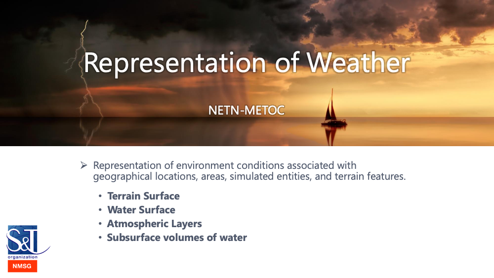

# NETN METOC
NATO Education and Training Network (NETN) Meteorological and Oceanographic (METOC) Module. 
        

## Introduction
This module is a specification of how to represent METOC related data to be shared among participants in a federated distributed simulation. The specification is based on IEEE 1516 High Level Architecture (HLA) Object Model Template (OMT) and primarily intended to support interoperability in a federated simulation (federation) based on HLA. An HLA OMT based Federation Object Model (FOM) is used to specify types of data and how it is encoded on the network. The NETN METOC FOM module is available as an XML file for use in HLA based federations.
        

### Purpose
The purpose of the NETN METOC module is to provide a standard way to exchange data related to weather conditions and primary effects of weather on terrain, on water surfaces, in the atmosphere and subsurface water conditions. The main objective is to provide a reference model that represents a core common subset of METOC related aspects and to allow extension of the module to incorporate additional detail if required. Therefore, the NETN METOC module shall be viewed as a reference FOM module where extensions are not only allowed but encouraged to fully meet federation specific requirements. However, any extension should also be considered as candidates for improving the NETN METOC module or candidates for new standard NETN modules.         

### Scope
Current weather conditions impact simulations such as platforms and sensors on the ground, on the sea, underwater and in the air. In a federated distributed simulation a correlated representation of these conditions is key to meet interoperability and model requirements. Different simulations require different fidelity of weather conditions concerning data resolution and accuracy.

The NETN METOC focus on the representation of weather conditions related to surfaces and layers. The main difference is that a surface condition does not have a volume and only represents the conditions directly related to the surface of a piece of terrain or water. The layer conditions represent a volume of water or air and are specified with hight/depth from surface and layer thickness. Both concepts are also geographically positioned by reference to other concepts shared in the federation such as the position of objects, areal objects or reference to terrain features such as roads etc.

Based on these concepts different levels of fidelity in representing weather conditions can be achieved. Global conditions can be expressed as well as highly detailed conditions e.g. surrounding a specific aircraft.

The aspects and attributes of weather conditions included in the scope of the NETN METOC module are based on input from several sources and are designed to cover the most common levels of representation required by a large set of existing simulators.

Atmospheric Layer Conditions cover the following aspects: Temperature, Winds, Precipitation, Haze, Humidity, Barometric Pressure, Visibility Range and Clouds.

Water Layer Conditions cover the following aspects: Temperature, Salinity and Currents.

Land Surface Conditions cover the following aspects: Temperature, Winds, Precipitation, Haze, Humidity, Barometric Pressure, Visibility Range, Snow Condition, Moisture and Ice Condition

Water Surface Conditions cover the following aspects: Temperature, Winds, Precipitation, Haze, Humidity, Barometric Pressure, Visibility Range, Sea State, Salinity, Tide, Ice Conditions, Currents, Waves and Swell. 

## Overview
Environment conditions are represented as object instances in the federation. Each instance is related to one of the following: Global condition (no GeoReference), condition related to specific object instance (RPR BaseEntity or Environment Object), explicitly defined geographical areas (Polygon or Circle) or a reference to WFS/GML identifier. 
 
Environment Condition Objects are either surface-based (land or water) or a layer (above terrain or below the water surface). 
 
Environment Condition Objects include either Weather attributes or Sub Surface (Water) attributes. 
 
Environment Condition Objects are created by any federate to express a need for environmental information. Ownership of environmental object attributes is divested to Weather Service federate(s) with the modelling responsibility of correlated environment conditions.
![][objectclasses]
	

[objectclasses]: ./objectclasses.png

## Licence

Copyright (C) 2019 NATO/OTAN.
This work is licensed under a [Creative Commons Attribution-NoDerivatives 4.0 International License](LICENCE.md). 

The work includes the [NETN-METOC.xml](NETN-METOC.xml) FOM Module and documentation NETN-METOC.md.

Above licence gives you the right to use and redistribute the NETN FOM Module (XML file and Documentation) in its entirety without modification. You are also allowed to develop new FOM Modules (in separate XML files and separate documentation) that build-on/extends the NETN module by reference and including necessary scaffolding classes. You are NOT allowed to modify this FOM Module or its documentation without prior permission by the NATO Modelling and Simulation Group. 

## Versions, updates and extensions

All updates and versioning of this work is coordinated by the NATO Modelling and Simulation Coordination Office (MSCO), managed by the NATO Modelling and Simulation Group (NMSG) and performed as NATO Science and Technology Organization (STO) technical activities in support of the NMSG Modelling and Simulation Standards Subgroup (MS3).

Feedback on the use of this work, suggestions for improvements and identified issues are welcome and can be provided using GitHub issue tracking. To engage in the development and update of this FOM Module please contact your national NMSG representative.

Version numbering of this FOM Module and associated documentation is based on the following principles:

* New official version number is assigned and in effect only when a new release is made in the Master branch.
* Updates in the Develop branch will not change the version number.
* In the FOM Module `useHistory` information includes only information on official releases.
* Update of the major version number is made if the change constitutes a major restructuring, merging, addition or redefinition of semantics that breaks backward compatibility or cover entirely new concepts.
* Update of the minor version number is made if the change constitutes minor additions to existing concepts and editorial changes that do not break backward compatibility but may require updates of software to use new concepts.
* Patches are released to fix minor issues that do not break backward compatibility.

|Version|Description|
|---|---|
|v1.0.0 (Planned) |Initial version based on input from MSG-156 and MSG-163 |

[Changelog](changelog.md)

## Documentation

[Full Documentation](NETN-METOC.md)
